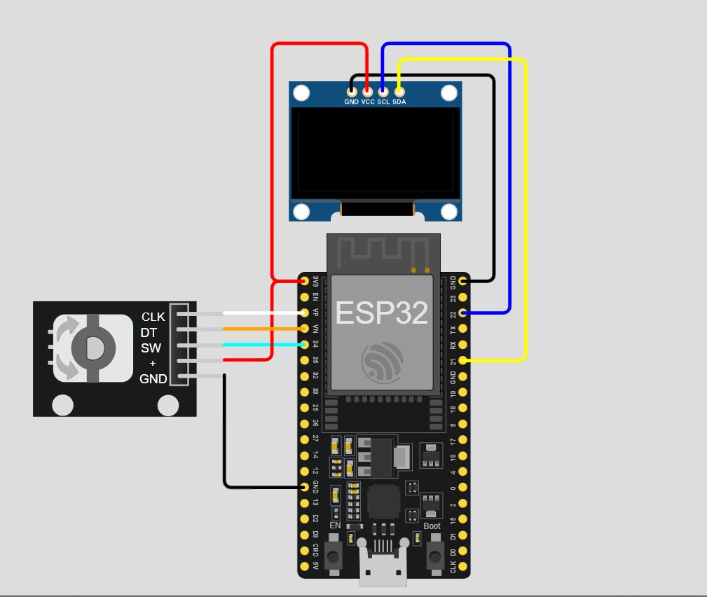
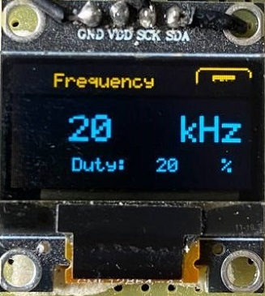
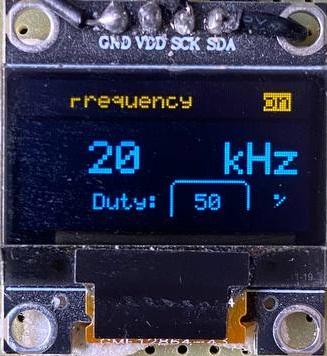
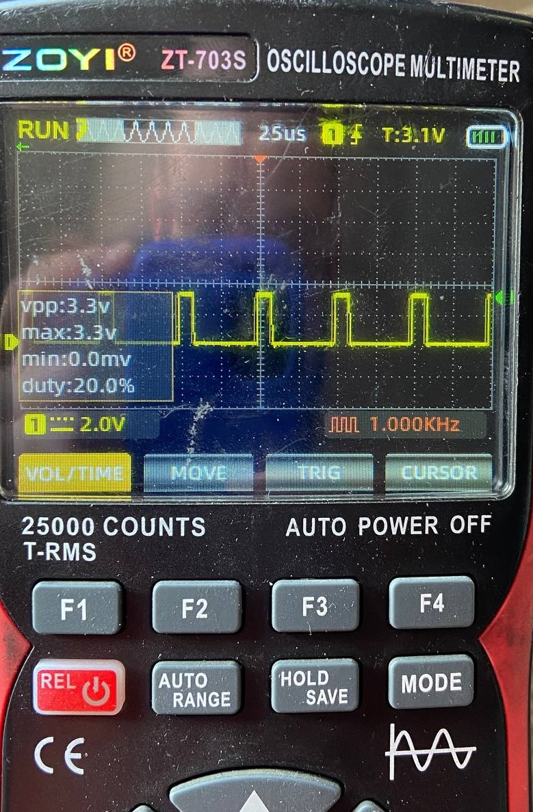
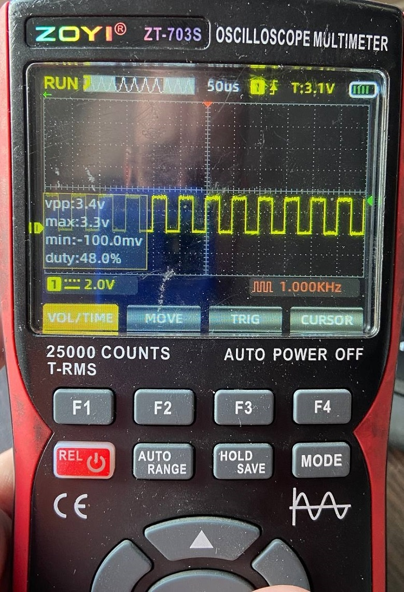

# 🚀 Генератор сигналов на ESP32 + SSD1306 + EC11

 <!-- Замените на актуальное изображение -->

Простой генератор ШИМ-сигналов с управлением энкодером и визуализацией параметров. Проект реализован на ESP32 с использованием OLED дисплея и энкодера.

## 📋 Основные возможности

- 🎛 Генерация ШИМ сигнала 2Гц - 313КГц
- ⚡ Регулировка скважности (5-95% с шагом 5%)
- 📺 Графический интерфейс на SSD1306 128x64
- 💾 Сохранение текущих параметров в EEPROM
- 🔄 Интуитивное управление энкодером
- 🔌 Аппаратная генерация сигнала (LEDC) РАБОТАЕМ над заменой

## 📦 Оборудование

| Компонент           | Характеристики                 |
| ------------------- | ------------------------------ |
| ESP32 Dev Board     | Двухъядерный MCU, 240 МГц      |
| OLED Display        | SSD1306, 128x64, I2C интерфейс |
| Ротационный энкодер | EC11 или аналогичный           |

## 🛠 Подключение компонентов

 <!-- Замените на схему подключения -->

```plaintext
ESP32S 30PINS  -  Компонент
=====================
GND         ENC GND
-//-        OLED GND
=====================
3.3V        ENC +
-//-        OLED VCC
=====================
G34         ENC SW (Кнопка)
VN          ENC DT (S1) (1)
VP          ENC CLK (S2) (-1)
G21         OLED SDA
G22         OLED SCL
G12         PWM Output 
```

## 📚 Используемые библиотеки

- [GyverOLED](https://github.com/GyverLibs/GyverOLED) - Управление дисплеем
- [EncButton](https://github.com/GyverLibs/EncButton) - Работа с энкодером
- [EEManager](https://github.com/GyverLibs/EEManager) - Работа с EEPROM
- [GyverIO](https://github.com/GyverLibs/GyverIO) - Требуется для работы EncButton

## 🖥 Интерфейс пользователя
Интерактивное меню с навигацией энкодером
Визуализация параметров в реальном времени
Адаптивное форматирование значений:
Гц/кГц/МГц для частоты

## 🔄 Алгоритм работы ШИМ
Автоматический подбор разрешения ШИМ
Плавная регулировка параметров
Аппаратная генерация сигнала

## ⚙️ Настройка проекта
Клонируйте репозиторий
Откройте проект в VS CODE > установите плагин PlatformIO и Espressif-IDF
Библиотеки лежать в репозитории.
Настройте пины оборудования в config.h:

## 🎮 Управление
Действие - Реакция системы
Поворот энкодера	Навигация по меню/изменение значения
Нажатие энкодера	Выбор параметра/сохранение
Долгое нажатие (2 сек)	Включение/выключение генератора

## ⚠️ Технические ограничения
Максимальная частота ШИМ: ~313 кГц (для 8-бит)
Точность на высоких частотах: ±5%
Амплитудное значение: 3.3В (без усилителя)


## Особенности
|||
| ------------------- | ----------------------- |
|||

## [](https://techno-touch.by/) Лицензия MIT
MIT License © 2023 [freeky92](https://github.com/freeky92) ООО "[TechnoTouch](https://techno-touch.by/)". Подробности в файле LICENSE.